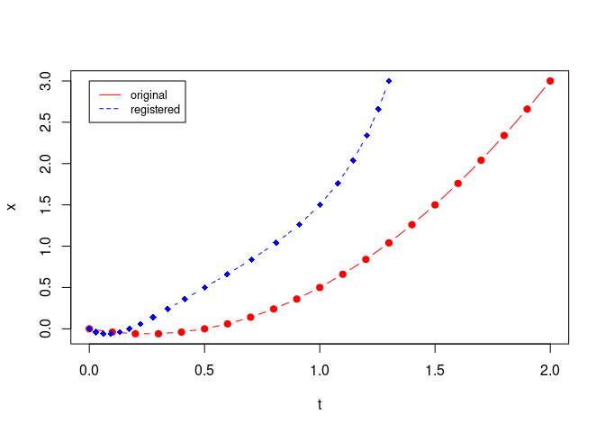

<!-- README.md is generated from README.Rmd. Please edit that file -->

# landmarkregUtils

<!-- badges: start -->
<!-- badges: end -->

The goal of landmarkregUtils is to provide a flexible version of the
`fda::landmarkreg` function. Essentially, the computation of time
warping functions $h(t)$ and their use to register curves are decoupled.
Wrapper functions allow to either apply landmark registration directly
on curve samples, thus hiding the `fda` details to the user, or on `fd`
objects. In the latter case, the log rate of the warping function,
i.e. $r(t) = - \log(\frac{dh}{dt})$, is also returned.

## Installation

You can install the development version of landmarkregUtils from
[GitHub](https://github.com/) with:

``` r
# install.packages("devtools")
devtools::install_github("uasolo/landmarkregUtils")
```

## Example

This is a basic example which shows you how to solve a common problem:

``` r
library(landmarkregUtils)
t <- seq(0,2, by=0.1) # original time axis
x <- t **2 - 0.5 * t # your input curve x(t)
inputMarks <- c(0, 1, 1.5, 2) # landmarks on x(t)
targetMarks <- c(0, 0.5, 1, 1.3) # where you want your landmarks to go
t_reg <- landmarkreg_timeSamples(t, inputMarks, targetMarks) # the registered time axis
plot(t, x, type="b", pch=19, col="red")
lines(t_reg, x, pch=18, col="blue", type="b", lty=2, xlab="t")
legend(0, 3, legend = c("original", "registered"), col=c("red", "blue"), lty=1:2, cex=0.8)
```


